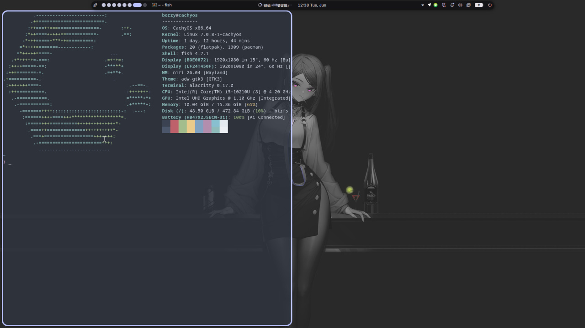
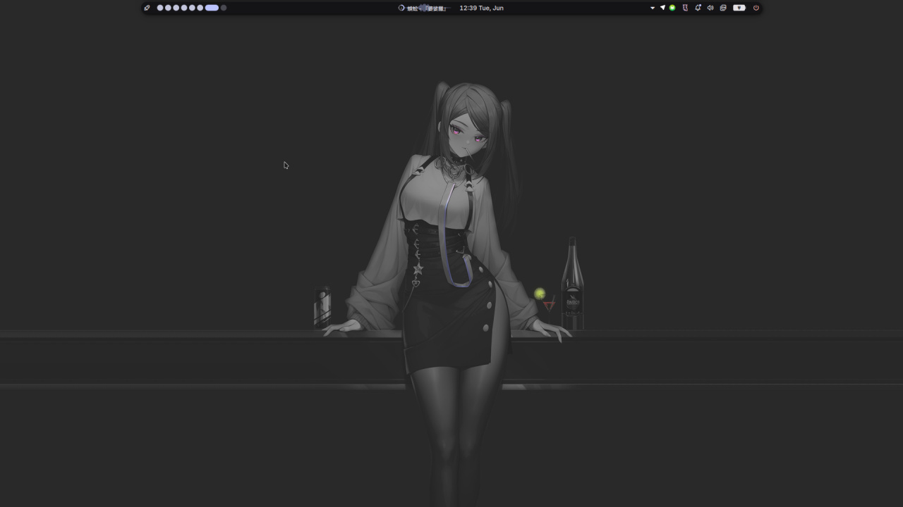
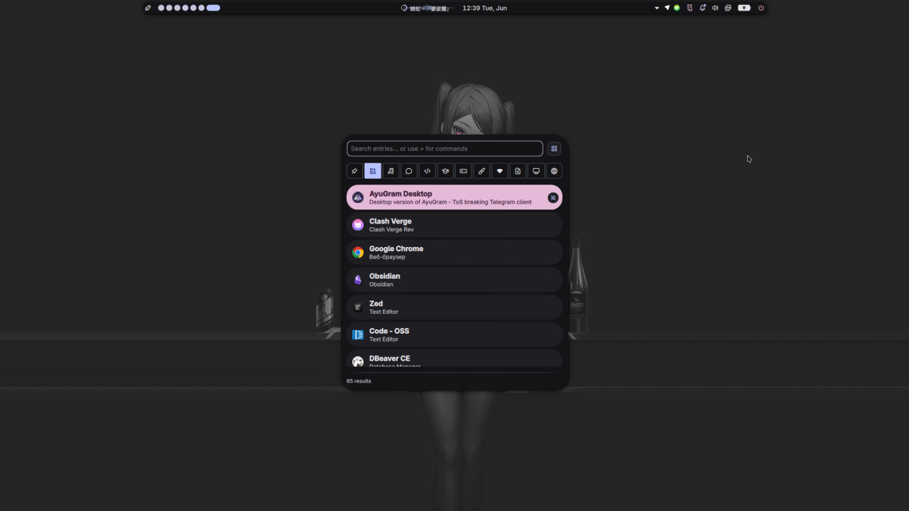

<h1 align="center">❄️ dotfiles</h1>

<p align="center">
  <a href="https://github.com/niri-wm/niri"><b>niri</b></a> +
  <a href="https://github.com/noctalia-dev/noctalia-shell"><b>Noctalia</b></a> setup on
  <a href="https://cachyos.org"><b>CachyOS</b></a>
</p>

<p align="center">
  
  
  
</p>

<p align="center">
  
</p>

---

## 🧩 Config Files

|     | Component   | Program                                                                      |
| :-: | :---------- | :--------------------------------------------------------------------------- |
| 🪟  | Compositor  | [niri](https://github.com/niri-wm/niri) `26.04` (scrollable-tiling, Wayland) |
| 🎨  | Shell / Bar | [Noctalia](https://github.com/noctalia-dev/noctalia-shell) (Quickshell)      |
| 💻  | Terminal    | [Alacritty](https://alacritty.org)                                           |
| 🐚  | Shell       | [fish](https://fishshell.com) `4.7`                                          |
| 🌐  | Browser     | [Zen](https://zen-browser.app)                                               |
| ✏️  | Editor      | [Zed](https://zed.dev)                                                       |
| 📝  | Notes       | [Obsidian](https://obsidian.md)                                              |
| 🎵  | Music       | [Spotify](https://open.spotify.com)                                          |
| 🚀  | Launcher    | Noctalia launcher                                                            |
| 🔒  | Polkit      | [noctalia polkit-agent](https://github.com/noctalia-dev/noctalia-plugins)    |
| 🖌️ | Theme       | Material You — colors from wallpaper (`tonal-spot`)                          |
| 🔤  | Font        | Adwaita Sans                                                                 |
| 🖱️ | Cursor      | capitaine-cursors                                                            |

---

## 🖼️ Gallery

<p align="center">
  
  
</p>

<p align="center"><sub>Clean desktop · Noctalia app launcher</sub></p>

---

## ⌨️ Keybindings

> `Mod` = `Super` (Windows key)

### Applications

| Keys | Action |
|:---|:---|
| `Mod` + `Return` | Open terminal (Alacritty) |
| `Mod` + `D` | App launcher |
| `Mod` + `B` | Browser (Zen) |
| `Mod` + `E` | File manager (Nautilus) |
| `Mod` + `O` | Notes (Obsidian) |
| `Mod` + `S` | Music (Spotify) |
| `Mod` + `C` | Editor (Zed) |

### Window / Focus

| Keys | Action |
|:---|:---|
| `Mod` + `Q` | Close window |
| `Mod` + `←` `→` `↑` `↓` | Focus column / window |
| `Mod` + `Ctrl` + `←` `→` `↑` `↓` | Move column / window |
| `Mod` + `F` | Maximize column |
| `Mod` + `T` | Toggle floating |
| `Mod` + `W` | Toggle tabbed display |
| `Mod` + `-` / `=` | Shrink / grow column width |
| `Mod` + `1`–`9` | Switch to workspace |
| `Mod` + `Ctrl` + `1`–`9` | Move column to workspace |
| `Mod` + `Tab` | Previous workspace |
| `Mod` + `Space` | Overview |

### System / Media

| Keys | Action |
|:---|:---|
| `Mod` + `Shift` + `S` | Screenshot region (grim + slurp + swappy) |
| `Ctrl` + `Shift` + `2` / `3` | Screenshot screen / window |
| `Mod` + `Alt` + `L` | Lock screen |
| `Mod` + `Shift` + `Q` | Session menu |
| `Mod` + `Shift` + `R` | Restart Noctalia |
| `Mod` + `Shift` + `P` | Power off monitors |
| `Ctrl` + `Alt` + `Del` | Quit niri |
| `XF86Audio*` / `XF86MonBrightness*` | Volume / brightness / media control |

> Full list: <kbd>Mod</kbd> + <kbd>Shift</kbd> + <kbd>Esc</kbd> opens the hotkey overlay.

---

## 📦 Installation

> [!WARNING]
> These are personal dotfiles — read them before applying. Back up your existing config first.

```bash
git clone https://github.com/<you>/dotfiles.git
cd dotfiles

# niri compositor
cp -r niri      ~/.config/niri

# Noctalia shell
cp -r noctalia  ~/.config/noctalia
```

### Dependencies

```bash
# Arch / CachyOS
sudo pacman -S niri quickshell alacritty fish nautilus \
               capitaine-cursors grim slurp swappy

# Flatpak apps
flatpak install app.zen_browser.zen com.spotify.Client
```

Then start (or restart) the session — Noctalia is launched automatically by niri:

```kdl
// niri/cfg/autostart.kdl
spawn-sh-at-startup "qs -c noctalia-shell"
```

---

## 📂 Structure

```
.
├── niri/                # ~/.config/niri
│   ├── config.kdl       # entry point (includes cfg/*)
│   ├── noctalia.kdl     # focus-ring / border / shadow colors
│   └── cfg/
│       ├── animation.kdl
│       ├── autostart.kdl
│       ├── display.kdl
│       ├── input.kdl
│       ├── keybinds.kdl
│       ├── layout.kdl
│       ├── misc.kdl
│       └── rules.kdl
└── noctalia/            # ~/.config/noctalia
    ├── settings.json    # bar, dock, launcher, control center…
    ├── colors.json      # active palette (generated from wallpaper)
    ├── colorschemes/
    └── plugins/         # polkit-agent
```

---

## 🎨 Theming

Colors are **dynamic** — Noctalia generates the whole palette from the current wallpaper
using Material You (`tonal-spot`, dark mode) and pushes matching themes to **Alacritty**,
**btop**, **niri** and **Zed** via templates. *Catppuccin Lavender* sits in
`colorschemes/` as a fallback preset but is inactive while `useWallpaperColors` is on.

Current palette (`colors.json`):

| Role | Color |
|:---|:---|
| Primary | `#bac3ff` |
| Tertiary / Hover | `#e5bad8` |
| Surface | `#131316` |
| Error / Urgent | `#ffb4ab` |
